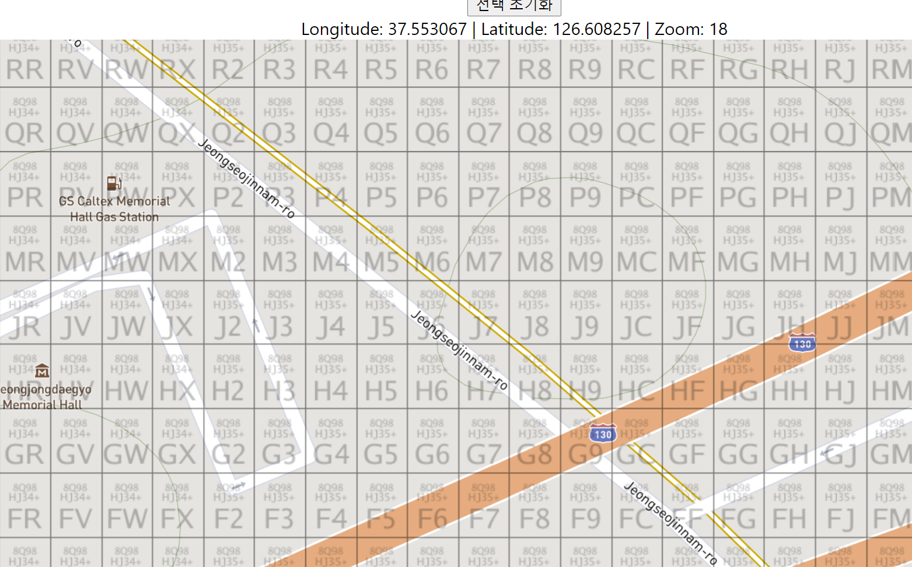

# REACT Map 

구글 지도와 Mapbox지도(오픈 스트리트 기반)에서 Grid를 다루는 모음

# D3AreaGraph

D3를 이용한 이동형 선택 그래프 그림  

# GoogleMapGrid

[turf](https://turfjs.org/) .squareGrid로 특정 지역의 10M 단위로 Grid를 그리고
선택, 해제 등의 작업을 함 

# MapboxGrid

[turf](https://turfjs.org/).squareGrid로 특정 지역의 10M 단위로 Grid를 그리고
선택, 해제 등의 작업을 함 

# GoogleMapPlusCodeGrid

구글 plusCode를 이용해서 자동적으로 전세계의 Grid를 그림(10M단위)
19레벨만 표시(20레벨 부터는 다른 그리드에 겹침 문제로 안됨)

# MapMapbox

[tilebelt](https://github.com/mapbox/tilebelt/)를 이용하여 10M 단위로 맵을 Tile을 그릴수있음.

장점
 - 백엔드에 데이터 의지하지 않을수있음 (데이터 이슈없음)
 - 프론트 단에서 모든게 처리 

기능 : 10M 단위로 선택, 해제, 그룹타일 선택 등의 작업이 가능.
 

## Tile 그리는 이론

 - https://wiki.openstreetmap.org/wiki/Slippy_map_tilenames

<a href src="./pds/tilebelt.pptx"/>

# GoogleMapPlusCodeGrid

구글 plusCode를 mapbox에 적용(이미지 Raster방식)

